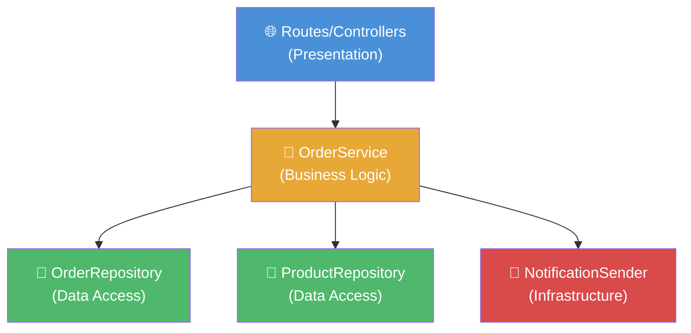

# Monoliths & Layered Architecture
## The Architecture Nobody Talks About (Because It's Not Sexy Enough)

Emmanuel G. | January 2026

---
layout: section
---

# War Story

## The Rewards System Trap

*"When Someone Builds Microservices Because They Saw a Netflix Talk"*

---

# The Setup

**The System:** Rewards platform — loyalty points, coupons, gift points

**The Original Developer:** Diego (one person, working alone)

*Diego is not a real person, or is he?*

---

# Diego's Brilliant Architecture

| Service | Purpose |
|---------|---------|
| Points Service | Track & calculate points |
| Coupon Service | Generate & validate coupons |
| Notification Service | Send emails & push |
| User Service | Profile & preferences |
| Analytics Service | Track redemptions |
| Gateway Service | Route everything |


---

# Then Diego Left. And I Inherited It.

**First feature request:** "Gift points" — users gift points to other users

**What it took:**

- Changes in **5 of 6 services**
- **5 separate deployments**
- **5 CI/CD pipelines to coordinate**
- **5 sets of integration tests**
- Debugging across **5 different log streams**

**For ONE feature.**

**Time estimate:** ~1 week

---

# Let's Look at the Actual Numbers

| Metric | Value |
|--------|-------|
| Active users | ~5,000 |
| Peak requests/sec | 50 |
| Team size | 1 (me) |
| Budget | Limited |
| Business logic | Highly interconnected |
| Deployment frequency | Once every 2 weeks |

<br>

**¿How many of the 6 context questions justify microservices?**

**Zero. Ninguna. Zero.**

---

# What I Actually Did

**Step 1:** Analyzed load and usage patterns

**Step 2:** Migrated to a monolith with well-defined modules

<div class="h-[25dvh] overflow-y-auto">

```
rewards-system/
├── modules/
│   ├── points/        ← Points calculation & tracking
│   ├── coupons/       ← Coupon generation & validation
│   ├── gifts/         ← Gift points (the new feature!)
│   ├── notifications/ ← Email & push notifications
│   └── analytics/     ← Redemption tracking
├── shared/
│   ├── auth/          ← Shared authentication
│   └── utils/         ← Common helpers
├── server.js          ← One entry point
└── package.json       ← One deployment
```
</div>

**One repo. One database. One deployment.**

---
layout: center
---

# The Result

**"Gift points" feature:** Changed 3 files. Wrote tests. Deployed in an afternoon.

**Performance:** *Faster* — no network calls between services. Everything in-process.

**Debugging:** One log stream. One process. One place to look.

<!--
This is the punchline. Slow down. Let it breathe.
-->

---
layout: center
---

# The Wisdom

> **Most of the time, a well-structured monolith is all you need.**
>
> Only change to a different architecture when the system
> **cannot handle the use case correctly.**
>
> Do not underestimate a monolith's compute power.

<!--
Consider having students read this aloud together. This is THE takeaway of the entire lesson. Write it on the board if possible.
-->

---
layout: section
---

# Part 2

## Monoliths, Layers, and Dependencies

*The theory behind the structure*

---

# "Monolith" Is NOT a Dirty Word

**Monolith = all your code deploys as a single unit.**

That's it. That's the definition.

### What a monolith is NOT:

| Myth | Reality |
|------|---------|
| "Big ball of mud" | That's bad code, not a monolith |
| "Can't scale" | Shopify, GitHub, Stack Overflow = monoliths |
| "Legacy" | You can build a modern monolith today |
| "Unmaintainable" | Structure determines maintainability, not architecture style |

---

# When Monoliths Are Right

Small-to-medium teams (1–10 devs)

Uncertain or evolving requirements — easier to refactor in one codebase

Moderate scale (<10K req/sec — that's A LOT)

Shared business logic — auth, pricing, notifications used everywhere

Transactional consistency matters — e-commerce, banking, healthcare

Limited operational maturity — no dedicated DevOps team

This describes ~90% of projects in Mexican consulting.

---
layout: center
---

# The Golden Rule

> ### Start with a monolith.
>
> ### Only break it apart when the monolith **CANNOT** handle your requirements.

Not "when it seems like a good idea."

Not "when you read a blog post about it."

Not "when you want it on your LinkedIn."

**When you have real, measured, proven constraints.**

---

# When Monoliths Are Wrong

**Multiple large teams** needing independent deployment cadence

**Genuinely different scalability needs** (video transcoding vs. API serving)

**Regulatory isolation** (PCI-compliant payments separated from public content)

**Netflix-level scale** — but you'll know if you're Netflix

<br>

**Notice:** These are organizational and regulatory problems, not technical preferences.

<!--
Be brief here. The point is: these scenarios exist but most students won't face them. Spend ~2 minutes max.
-->

---

# "Okay, monolith. But how do I avoid THIS?"

```javascript
// server.js — 2,000 lines of "everything"
app.post('/orders', async (req, res) => {
  // validate input... 20 lines
  // check auth... 15 lines
  // check inventory... 30 lines
  // calculate discount... 40 lines
  // create order in DB... 25 lines
  // update inventory... 15 lines
  // send confirmation email... 20 lines
  // send to analytics... 10 lines
  // handle errors... 30 lines
  // return response
});
```

**This is not a monolith problem. This is a structure problem.**

**The answer: layers.**

<!--
This transitions from "monoliths are okay" to "BUT they need structure." Don't skip this — it's the answer to "but monoliths get messy."
-->

---

# Layered Architecture

Think of it like a building — each floor has a purpose.

```
┌─────────────────────────────────┐
│     🌐 PRESENTATION LAYER      │  ← HTTP in, HTTP out
│     Routes, Controllers         │
├─────────────────────────────────┤
│     🧠 BUSINESS LOGIC LAYER    │  ← Rules, calculations, workflows
│     Services, Use Cases         │
├─────────────────────────────────┤
│     💾 DATA ACCESS LAYER       │  ← Queries, ORM, DB operations
│     Repositories                │
├─────────────────────────────────┤
│     🔌 INFRASTRUCTURE LAYER    │  ← External: email, storage, APIs
│     Adapters, Clients           │
└─────────────────────────────────┘
```

**Each layer has ONE job.**

<!--
Draw this live if possible. The building metaphor works well. Point out that each floor has a clear purpose — you wouldn't put the kitchen on the roof.
-->

---
layout: center
---

# The ONE Rule of Layers

> ## Dependencies ALWAYS flow downward. NEVER upward.

✅ Controller calls Service

✅ Service calls Repository

❌ Repository imports Controller

❌ Data Access calls Presentation

**Break this rule and your layers are just folders, not architecture.**

<!--
This is the most important technical slide. If they remember nothing else about layers, this is it.
-->

---

# Dependency Inversion

**"But what if my business logic needs to send an email?"**

The trick: don't depend on the *specific* implementation.

<div class="h-[25dvh] overflow-y-auto">

```javascript
// Business Logic defines WHAT it needs (interface)
// "I need something that sends notifications"
class OrderService {
  constructor(notificationSender) {  // ← doesn't know if email, SMS, pigeon
    this.notificationSender = notificationSender;
  }
}

// Infrastructure provides HOW (implementation)
class EmailNotificationSender {
  async send(to, message) {
    // ... actual email logic
  }
}
```
</div>

**If you swap email for SMS tomorrow, `OrderService` doesn't change. Zero changes.**

<!--
The "pigeon" joke lands well. Use it. The point is that business logic defines what it needs, infrastructure provides it.
-->

---
layout: two-cols
---

# Two Ways to Organize

### Package by Layer:

```
src/
├── controllers/
│   ├── products.js
│   ├── orders.js
│   └── users.js
├── services/
│   ├── products.js
│   ├── orders.js
│   └── users.js
└── repositories/
    ├── products.js
    ├── orders.js
    └── users.js
```

::right::

<br><br>

### Package by Feature:

```
src/
├── products/
│   ├── controller.js
│   ├── service.js
│   └── repository.js
├── orders/
│   ├── controller.js
│   ├── service.js
│   └── repository.js
└── users/
    ├── controller.js
    ├── service.js
    └── repository.js
```

---

# Why Package by Feature Wins

**1. Cohesion** — Everything about "orders" lives in one folder

**2. Navigation** — Changing orders? Look in `/orders`. Done.

**3. Natural extraction path** — Need a microservice someday? `/orders` is already isolated

**4. Team ownership** — "You're working on *products*, I'm working on *orders*" — zero file conflicts

**5. Encapsulation** — Each feature can have internal helpers that don't leak

---
layout: section
---

# Part 3

## Before & After: Code Examples

*From spaghetti to structure*

---

# The God Route (Before)

<div class="h-[30dvh] overflow-y-auto">

```javascript
// server.js — DON'T DO THIS
app.post('/api/orders', async (req, res) => {
  try {
    // Authentication
    const token = req.headers.authorization?.split(' ')[1];
    const decoded = jwt.verify(token, process.env.JWT_SECRET);

    // Validation
    if (!req.body.products || !Array.isArray(req.body.products)) {
      return res.status(400).json({ error: 'Products required' });
    }

    // Business logic — discount calculation
    let total = 0;
    for (const item of req.body.products) {
      const product = await db.query(
        'SELECT * FROM products WHERE id = $1', [item.id]
      );
      if (product.rows[0].stock < item.quantity) {
        return res.status(400).json({ error: 'Not enough stock' });
      }
      let price = product.rows[0].price * item.quantity;
      if (item.quantity > 10) price *= 0.9; // 10% discount
      total += price;
    }
    // ... 100 more lines of mixed concerns ...
```

</div>

**Auth, validation, business logic, DB queries — all in one function.**

---

# Presentation Layer (After)

<div class="h-[30dvh] overflow-y-auto">

```javascript
// routes/orders.js — ONLY handles HTTP
const OrderService = require('../orders/service');

router.post('/api/orders', authenticate, async (req, res) => {
  try {
    const order = await OrderService.create(
      req.user.id,
      req.body.products
    );
    res.status(201).json(order);
  } catch (error) {
    if (error.name === 'ValidationError') {
      return res.status(400).json({ error: error.message });
    }
    if (error.name === 'InsufficientStock') {
      return res.status(409).json({ error: error.message });
    }
    res.status(500).json({ error: 'Internal server error' });
  }
});
```

</div>

**This route knows NOTHING about discounts, databases, or emails.**

---

# Business Logic Layer (After)

```javascript
// orders/service.js — ONLY business rules
class OrderService {
  constructor(orderRepo, productRepo, notifier) {
    this.orderRepo = orderRepo;
    this.productRepo = productRepo;
    this.notifier = notifier;
  }

  async create(userId, items) {
    if (!items?.length) throw new ValidationError('Products required');

    let total = 0;
    for (const item of items) {
      const product = await this.productRepo.findById(item.id);
      if (product.stock < item.quantity) {
        throw new InsufficientStock(product.name);
      }
      total += this.calculatePrice(product, item.quantity);
    } // and so on...
```

<!--
Walk through this slowly. Point out: no req, no res, no SQL, no email details. Pure business logic. "You can test this with just JavaScript — no HTTP server, no database needed."
-->

---

# Data Access Layer (After)

<div class="h-[30dvh] overflow-y-auto">

```javascript
// orders/repository.js — ONLY database operations
class OrderRepository {
  constructor(db) {
    this.db = db;
  }

  async create(userId, items, total) {
    const result = await this.db.query(
      'INSERT INTO orders (user_id, items, total) VALUES ($1, $2, $3) RETURNING *',
      [userId, JSON.stringify(items), total]
    );
    return result.rows[0];
  }

  async findByUserId(userId) {
    const result = await this.db.query(
      'SELECT * FROM orders WHERE user_id = $1 ORDER BY created_at DESC',
      [userId]
    );
    return result.rows;
  }
}
```

</div>

**Switch from PostgreSQL to MySQL tomorrow?**
Change: `OrderRepository`. Don't change: everything else.

---

# Let's Diagram It



**Arrows = dependency direction. Always down. Never up.**

📝 *You can draw this with boxes and arrows on a napkin. That's valid architecture documentation.*

---

# What Did We Gain?

| Concern | Before (God Route) | After (Layers) |
|---------|--------------------|----|
| **Testing** | Need HTTP + DB to test anything | Test business logic in isolation |
| **Reuse** | Copy-paste between routes | Call `OrderService.create()` from anywhere |
| **DB change** | Touch every route | Touch only repositories |
| **Email change** | Touch order logic | Touch only NotificationSender |
| **Teamwork** | Everyone in one file | You work on different modules |
| **Debugging** | Where's the bug? | Bug in discount? → `OrderService` |

---
layout: section
---

# Part 4

## Case Study: TiendaNube 🛒

*Your turn to plan a refactoring*

---

# 🛒 TiendaNube

**A small online store for Mexican artisanal products** — alebrijes, textils, ceramics

**The situation:**

- Built by a solo developer
- It WORKS — all endpoints return correct data
- But... everything lives in `server.js`
- 200+ lines, growing every week
- The developer is afraid to touch anything

**Your mission:** Plan the refactoring.

---

# What You'll Find Inside

- JWT verification **copy-pasted** in every route (4 times)

- Discount calculation **inline** with HTTP handling

- Raw SQL queries **scattered** in route handlers

- Email sending **mixed** with order creation

- Product validation **duplicated** across routes

- **Zero separation** between "what the API does" and "what the business rules are"

(Bombastic side eye)

**Sound familiar? This is every "my first project" ever.**

---

# Lesson 5 Assignment: Refactor Plan

**You will receive** the TiendaNube `server.js` (working, tested, messy)

**You must deliver:**

1. **Architecture diagram** (Mermaid or hand-drawn)
   Show your proposed layers, modules, and dependency direction

2. **Layer description** — What goes in each layer? (1–2 sentences each)

3. **Refactoring roadmap** — What do you migrate first, second, third? Why?

4. **One refactored module** — Pick the easiest feature and actually refactor it

**Hint:** Think package by feature. What are the features? Products, orders, users.

---

# What to Remember

1. **Monolith ≠ bad.** A well-structured monolith handles 90% of real-world projects.

2. **Only change architecture when the monolith CAN'T handle it.** Not when you're bored.

3. **Layers = discipline.** Dependencies ALWAYS flow downward.

4. **Package by feature > package by layer.** Keep related code together.

5. **A napkin diagram is architecture.** Don't overthink the tooling.

6. **Do not underestimate a monolith's compute power.** Seriously.

---

# Resources

**Readings:**

- "Choose Boring Technology" — Dan McKinley
- "MonolithFirst" — Martin Fowler (martinfowler.com)
- "Stack Overflow: The Architecture" — Nick Craver (nickcraver.com) 

**Reference:**

- Student handout 

**Coming up:** Microservices & Distributed Systems

---
layout: center
---

# Thank You!
