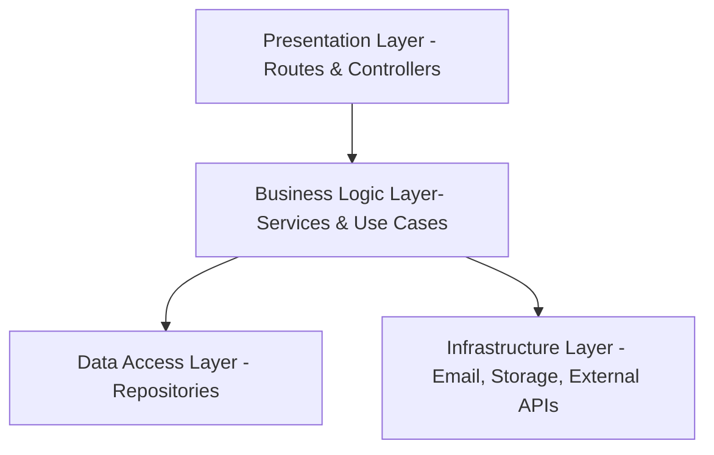
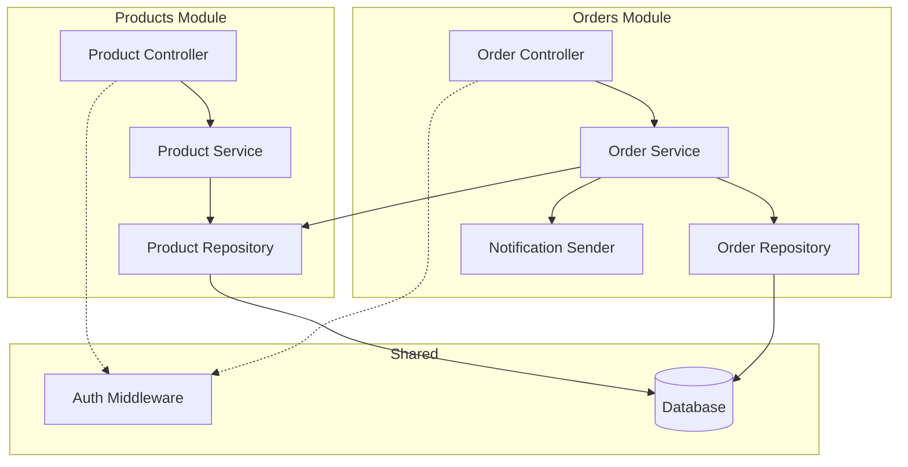

# Lesson 5: Monoliths and Layered Architecture
## Student Handout — Reference Guide

*Redis (Paper-Server Edition) — Your offline reference for architectural patterns*

## How to Use This Handout

This is your reference guide for monolithic and layered architecture patterns. Keep it next to you while working on the TiendaNube assignment. You don't need to memorize this — you need to know where to look.

---

## The Golden Rule

> **Start with a monolith. Only break it apart when the monolith CANNOT handle your requirements.**

"Cannot" means: you've profiled it, optimized it, scaled it vertically, and you're hitting **real, measured constraints**. Not theoretical ones. Not ones from a conference talk.

**Most of the time, a well-structured monolith is all you need.**

---

## What Is a Monolith?

**Definition:** All your code deploys as a single unit.

That's it. Everything else people associate with "monolith" is actually about code quality, not architecture style.

### Monolith Myths vs. Reality

| Myth | Reality |
|------|---------|
| "Big ball of mud" | Bad code ≠ monolith. You can have messy microservices too. |
| "Can't scale" | Shopify, GitHub, Stack Overflow ran as monoliths at massive scale. |
| "Legacy / outdated" | You can build a modern, beautiful monolith with today's tools. |
| "Hard to maintain" | Structure determines maintainability, not deployment model. |

---

## When to Use Each Pattern

### Monolith Is Right When:

- **Team size:** 1–10 developers
- **Requirements:** Uncertain or changing frequently
- **Scale:** <10,000 requests/second (this is more than most systems ever see)
- **Business logic:** Shared across features (auth, pricing, notifications)
- **Consistency:** Transactional integrity matters (orders, payments, records)
- **Operations:** No dedicated DevOps team or limited infrastructure budget

### Monolith Is Wrong When:

- **Multiple large teams** need to deploy independently at different cadences
- **Genuinely different scalability needs** within the system (e.g., video processing vs. API)
- **Regulatory isolation** requirements (PCI compliance, healthcare data separation)
- **Extreme scale** that a single deployment unit cannot handle after optimization

### Quick Decision Helper

Ask yourself these questions:

1. How many developers will work on this? → If <10, strongly favor monolith
2. Does business logic cross features? → If yes, monolith avoids duplication
3. Do you have a DevOps team? → If no, microservices will hurt
4. What's your actual (not imagined) traffic? → If <10K req/sec, monolith handles it
5. Do different parts NEED to scale independently? → If no, monolith

If you answered "monolith" to 3+ questions, start with a monolith.

---

## Layered Architecture

Layers organize code within a monolith so it doesn't become spaghetti. Think of each layer as a floor in a building — each has a specific purpose.

### The Four Layers

#### 1. Presentation Layer
**Purpose:** Handle HTTP requests and responses. Nothing else.

**Contains:**
- Route definitions
- Request parsing and validation (format, not business rules)
- Response formatting
- Authentication middleware
- Error response mapping

**Does NOT contain:**
- Business logic
- Database queries
- Email sending
- Discount calculations

**Example files:** `routes/orders.js`, `controllers/productController.js`, `middleware/auth.js`

#### 2. Business Logic Layer
**Purpose:** Implement the rules of the business. The "brain" of the system.

**Contains:**
- Business rules and calculations
- Workflow orchestration
- Business validation ("is this order valid?")
- Domain-specific logic

**Does NOT contain:**
- HTTP status codes
- `req` and `res` objects
- SQL queries
- API calls to external services (directly)

**Example files:** `orders/service.js`, `products/service.js`, `pricing/calculator.js`

**Key principle:** You should be able to test the entire business logic without starting an HTTP server or connecting to a database.

#### 3. Data Access Layer
**Purpose:** Talk to the database. Translate between code objects and database rows.

**Contains:**
- Database queries (SQL or ORM calls)
- Data mapping (rows → objects)
- Query optimization
- Transaction management

**Does NOT contain:**
- Business rules
- HTTP handling
- Email logic

**Example files:** `orders/repository.js`, `products/repository.js`

#### 4. Infrastructure Layer
**Purpose:** Handle everything external — email, file storage, third-party APIs.

**Contains:**
- Email sending
- File upload/download
- External API clients (payment gateways, shipping APIs)
- Push notification services
- Logging infrastructure

**Example files:** `infrastructure/emailSender.js`, `infrastructure/paymentClient.js`

---

### The One Rule of Layers

> **Dependencies ALWAYS flow downward. NEVER upward.**

```
Presentation  →  Business Logic  →  Data Access
                                  →  Infrastructure
```

- ✅ A controller CAN call a service
- ✅ A service CAN call a repository
- ❌ A repository CANNOT import a controller
- ❌ Data access CANNOT call presentation

If you break this rule, your layers are just folder names — not architecture.

---

### Dependency Inversion (The Elegant Solution)

**Problem:** Business logic needs to send emails. Email is in Infrastructure.

**Solution:** Business logic defines an *interface* (what it needs). Infrastructure *implements* it (how it works).

```javascript
// Business Logic says: "I need something that sends notifications"
class OrderService {
  constructor(notificationSender) {
    this.notificationSender = notificationSender;
  }
  
  async createOrder(userId, items) {
    // ... business logic ...
    await this.notificationSender.send(userId, 'Order confirmed');
  }
}

// Infrastructure provides the implementation
class EmailNotificationSender {
  async send(userId, message) {
    // ... actual email sending logic ...
  }
}

// Wiring it together (in your app setup / composition root)
const notifier = new EmailNotificationSender();
const orderService = new OrderService(notifier);
```

**Why this matters:** If you switch from email to SMS tomorrow, `OrderService` doesn't change at all. Zero modifications.

---

## Code Organization

### Package by Feature (Recommended)

```
src/
├── products/
│   ├── controller.js    ← Routes for products
│   ├── service.js       ← Product business logic
│   ├── repository.js    ← Product database queries
│   └── validator.js     ← Product input validation
├── orders/
│   ├── controller.js
│   ├── service.js
│   ├── repository.js
│   └── validator.js
├── users/
│   ├── controller.js
│   ├── service.js
│   └── repository.js
├── shared/
│   ├── auth/            ← Shared authentication middleware
│   ├── database/        ← Database connection setup
│   └── errors/          ← Custom error classes
├── infrastructure/
│   ├── email.js         ← Email sending
│   └── storage.js       ← File storage
├── app.js               ← Express app setup
└── server.js            ← Entry point
```

**Why it wins:**
- Need to change "orders"? Everything is in `/orders`
- Two developers? "Tú trabajas en products, yo en orders"
- Extract a feature as microservice later? It's already isolated

### Package by Layer (Less Recommended)

```
src/
├── controllers/
│   ├── products.js
│   ├── orders.js
│   └── users.js
├── services/
│   ├── products.js
│   ├── orders.js
│   └── users.js
├── repositories/
│   ├── products.js
│   ├── orders.js
│   └── users.js
```

**Why it's weaker:** To change "orders," you jump between 3+ folders. Related code is scattered.

---

## Refactoring Strategy: How to Untangle Spaghetti

When you inherit messy code (and you will), here's a step-by-step approach:

### Step 1: Don't Rewrite. Refactor.

Rewriting from scratch is almost always a mistake. Instead, extract piece by piece.

### Step 2: Identify the Features

What does the system DO? List the features:
- Products (CRUD, search)
- Orders (create, list, cancel)
- Users (register, login, profile)

### Step 3: Extract Shared Concerns First

Before touching features, extract things that are duplicated everywhere:
- Authentication middleware (replace copy-pasted JWT checks)
- Error handling (create custom error classes)
- Database connection (single pool, shared across repositories)

### Step 4: Extract One Feature at a Time

Pick the simplest feature. For each:
1. Create the feature folder (`/products`)
2. Extract the repository (database queries)
3. Extract the service (business logic)
4. Simplify the route (should only handle HTTP)
5. Run tests — everything should still work

### Step 5: Repeat for Each Feature

Go feature by feature. Don't try to do everything at once.

### Refactoring Priority Order:

| Priority | What | Why |
|----------|------|-----|
| 1st | Shared auth/middleware | Eliminates the most duplication |
| 2nd | Simplest feature | Low risk, builds confidence |
| 3rd | Most-changed feature | Highest ROI for maintainability |
| Last | Complex features | Wait until patterns are established |

---

## Quick Reference: "Where Does This Code Go?"

| If the code is about... | It belongs in... |
|--------------------------|------------------|
| Parsing HTTP request body | Presentation (Controller) |
| Checking if user is logged in | Presentation (Middleware) |
| "Orders over $500 get free shipping" | Business Logic (Service) |
| `SELECT * FROM products WHERE...` | Data Access (Repository) |
| Sending a confirmation email | Infrastructure |
| "Is the email format valid?" | Presentation (Validator) |
| "Does this user have enough credit?" | Business Logic (Service) |
| Uploading a file to S3 | Infrastructure |
| Returning a 404 status code | Presentation (Controller) |
| Calculating a discount percentage | Business Logic (Service) |

---

## Mermaid Diagram Reference

You can use Mermaid to create architecture diagrams. But remember: **hand-drawn boxes and arrows on a napkin are perfectly acceptable architecture documentation.**

### Basic Layered Architecture Diagram




### Feature-Based Module Diagram



**Paste these snippets into a Mermaid editor like [Mermaid Live Editor](https://mermaid.live/) to visualize.**

---

## Key Vocabulary

| Term | Definition |
|------|-----------|
| **Monolith** | All code deploys as a single unit |
| **Layered Architecture** | Organizing code in layers with strict dependency direction |
| **Separation of Concerns** | Each piece of code has one clear responsibility |
| **Cohesion** | Related code stays together (high cohesion = good) |
| **Coupling** | How much one piece depends on another (low coupling = good) |
| **Dependency Inversion** | Depend on abstractions, not concrete implementations |
| **Package by Feature** | Organize code by business capability (products, orders, users) |
| **Package by Layer** | Organize code by technical role (controllers, services, repositories) |
| **God Route / God Function** | A single function that does everything — anti-pattern |
| **Big Ball of Mud** | Code with no discernible structure — anti-pattern |
| **Distributed Monolith** | Microservices that are so coupled they must deploy together — worst of both worlds |

---

## This Lesson's Assignment: TiendaNube Refactoring Plan

You'll receive the TiendaNube deliverable guide including the server.js code — a working but messy Express API for a Mexican artisan goods store.

### What to Deliver:

1. **Architecture diagram** — Show your proposed layers and modules (Mermaid or hand-drawn photo)
2. **Layer description** — 1–2 sentences per layer explaining what goes there
3. **Refactoring roadmap** — What do you extract first? Second? Third? Why that order?
4. **One refactored module** — Pick the easiest feature and actually implement the layered version

### Tips:

- Start by reading all of `server.js` before planning
- Identify the features first (what does TiendaNube do?)
- Look for duplicated code — that's your first extraction target
- Don't try to make it perfect. Make it organized.
- Use the "Where Does This Code Go?" table above

---

*Student Handout — Lesson 5 | Monoliths & Layered Architecture*
*Keep this handy during the assignment. It's your cheat sheet.*
